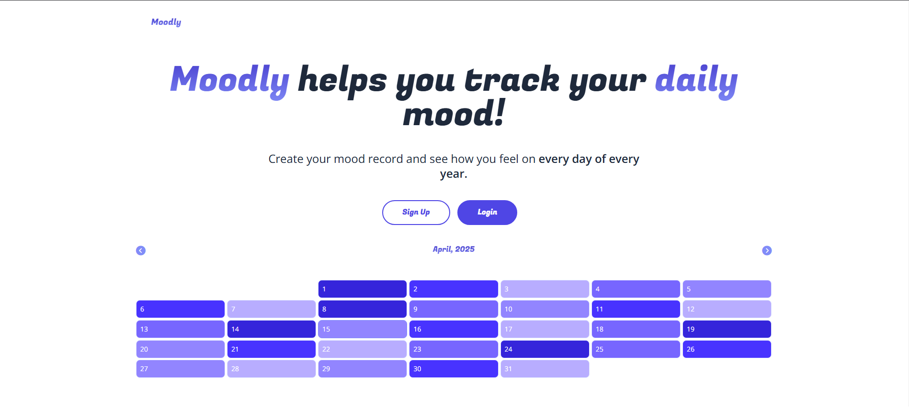
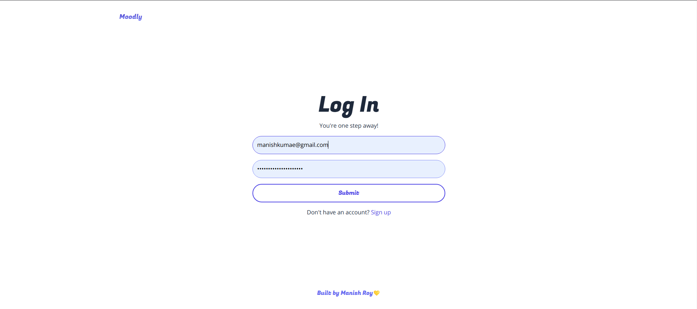
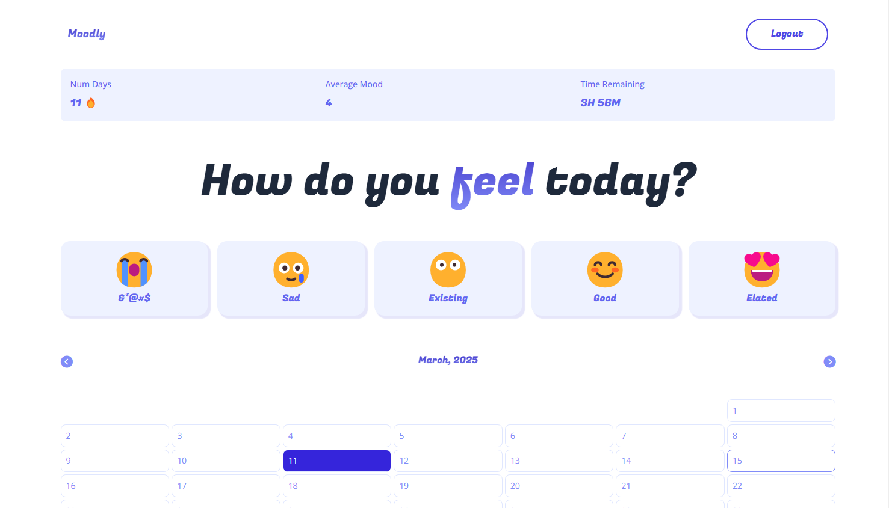

# Moodly

# 🎭 Moodly - Your Daily Mood Tracker

**Moodly** is a modern mood-tracking web application that empowers users to log their emotions, analyze emotional trends, and gain deeper self-awareness through visual insights. Built with **Next.js**, **Tailwind CSS**, and **Firebase**, it offers a smooth, responsive experience across all devices.

---

## 🔗 Live Demo

👉 [Click here to explore Moodly](https://moodly-five.vercel.app/)

---

## 🖼️ Screenshot

> Add a screenshot in the repository at `screenshot/moodly.png` to display below.



 ---

## 🛠️ Tech Stack

- **Next.js** – Server-side rendering and routing
- **Tailwind CSS** – Utility-first responsive UI design
- **JavaScript** – Core application logic
- **Node.js & Express.js** – Backend API handling
- **Firebase** – Authentication and real-time database

---

## 🌟 Features

- 📅 **Daily Mood Logging** – Track your mood in a simple, intuitive interface
- 📊 **Mood Analytics** – View trends and emotional patterns through clean data visualizations
- 🔐 **Secure Authentication** – Login and signup with Firebase Authentication
- 📱 **Responsive Design** – Fully functional across mobile, tablet, and desktop devices
- ⚡ **Optimized Performance** – Fast loading and smooth interactions

---

## 🚀 Getting Started

### 📦 Prerequisites


- [Node.js](https://nodejs.org/) (v14.x or higher)
- [Firebase](https://firebase.google.com/) for authentication and database
- [Next.js](https://nextjs.org/)

### Installation

1. **Clone the repository:**

   ```bash
   git clone https://github.com/yourusername/moodly.git
   cd moodly
   ``` 
2. **Install dependencies::**

   ```bash
   npm install
   ```

3. **Set up Firebase:**

    - Go to the Firebase console.
    - Create a new project, and set up Authentication and Firestore.
    - Add your Firebase configuration to a .env.local file in the root directory:

    ```bash
    NEXT_PUBLIC_FIREBASE_API_KEY=your_api_key
    NEXT_PUBLIC_FIREBASE_AUTH_DOMAIN=your_project_id.firebaseapp.com
    NEXT_PUBLIC_FIREBASE_PROJECT_ID=your_project_id
    NEXT_PUBLIC_FIREBASE_STORAGE_BUCKET=your_project_id.appspot.com
    NEXT_PUBLIC_FIREBASE_MESSAGING_SENDER_ID=your_sender_id
    NEXT_PUBLIC_FIREBASE_APP_ID=your_app_id
    ```

### Running the Development Server :

- To start the development server, run:

    ```bash
    npm run dev
    ```

### Developed by Manish Kumar 
